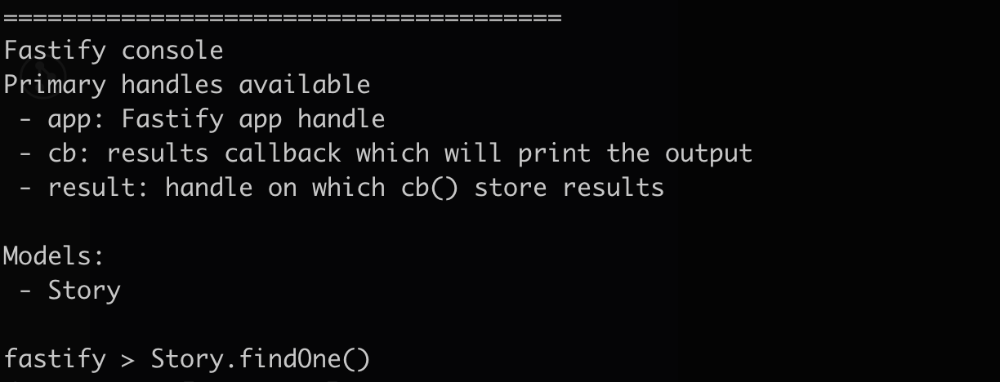

# fastify-console
Command line tool to debug fastify app and execute app methods directly.


#### Install
```
  npm i fastify-console -s
```

#### Setup
To use the package you have to intergrate with your `server.js` file in your project.
``` javascript
  const Fastify = require('fastify');
  const fp = require('fastify-plugin');
  const FastifyConsole = require('fastify-console');
  // Instantiate Fastify with some config
  const app = Fastify({ logger: true, pluginTimeout: 3000 });
  const App = require('./app');

  // Register your application as a normal plugin.
  app.register(fp(App), {});

  if (FastifyConsole.active()) {
    app.ready((error) => {
      if (error) {
        // eslint-disable-next-line no-console
        console.error(error);
        return false;
      }
      return FastifyConsole.start(app, {
        prompt: 'fastify > ',
      });
    });
  } else if (require.main === module) {
    // Start listening.
    app.listen(process.env.PORT || 3000, '0.0.0.0', (err) => {
      if (err) {
        app.log.error(err);
        process.exit(1);
      }
    });
  }
```

use below command to run console
```javascript
node server.js --console
```

for ease of use you can update your `package.json` as below and then run `npm run console`
```javascript
  "scripts": {
    "console": "node server.js --console",
  }
```

#### Configurations
| Option            | Type           | Defaults     |  Descriptions   |
| ----------------- |:-------------: | :----------: | :-------------: |
| quiet             | Boolean        | false        | Displays help descriptions when console get started                |
| prompt            | String         | fastify >    | The input prompt to display.                |
| useGlobal         | Boolean        | true         | Default evaluation function will use the JavaScript global        |
| ignoreUndefined   | Boolean        | true         | Writer will not output the return value of a command if it evaluates to `undefined`                |
| historyPath       | String         | ''           | The path to a file to persist command history. eg: `.data/history.log` |

Note:
  1. History feature will work only for on and above Node 12 version.
  2. For more details about config please check [NodeJS Repl](https://nodejs.org/api/repl.html)

-------------------------------------------
#### Examples
`app` handle provide the `fastify` instance which is being used in application.
1. Provide accessibility to all `plugin` by assigned `decorator`
for example if we registerd timestamp decorator as below
```javascript
  module.exports = fp(async (fastify, opts) => {
    fastify.decorate('timestamp', () => Date.now());
  });
```
then we can execute it directly from console by using `app.timestamp()`

2. Provide accessibility to `routes` of application
```javascript
  app.inject({ url: '/home', methods: 'GET', headers: {access_token: 'my-secret-token'} })
```
3. Provide accessibility to registered `models` from `mongoose`
```javascript
  class StoryClass {
    // `getFullTitle()` becomes a document method
    getFullTitle() {
      return this.title;
    }
  }

  module.exports = {
    name: 'Story',
    alias: 'Story',
    schema: {
      title: {
        type: String,
        required: true,
      },
    },
    class: StoryClass,
  };
```
```javascript
  Story.findOne().then(story => story.getFullTitle())
```
Note: `fastify-console` uses `fastify-mongoose-driver` plugin to access `models` in console.
or you can use `mongoose` decorator for mongo connections.
please check [`mongoose`](https://mongoosejs.com/docs/guide.html) for better understanding about schema definations.

-------------------------------------------
#### Inspired By
[Loopback Console](https://github.com/doublemarked/loopback-console)

---------------------------------------------
#### License

fastify-console uses the MIT license. See [LICENSE](./LICENSE) for more details.
